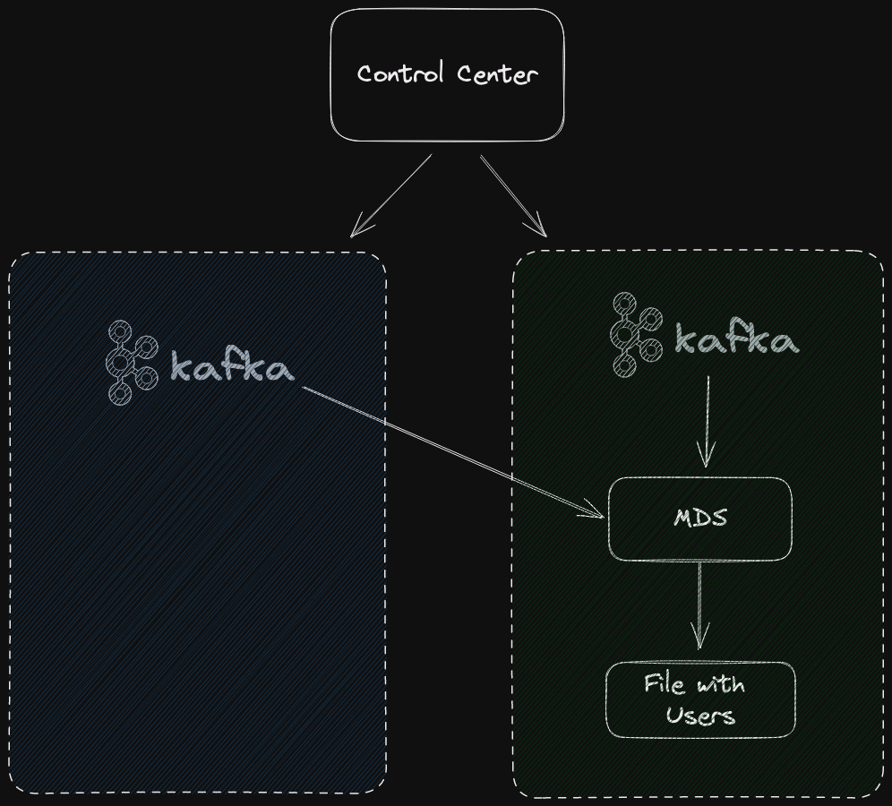

# Confluent Platform with External MDS

## References

- [Confluent MDS](https://docs.confluent.io/platform/current/kafka/configure-mds/index.html)
- [Confluent RBAC](https://docs.confluent.io/platform/current/security/rbac/index.html)

## Architecture

Confluent MDS is a component of Confluent Platform needed for RBAC setup. The goal of this demo is to demonstrate how to use a centralized MDS in more than one cluster, and how to use one single Control Center to monitor them.

Setup:

- 1 Confluent Platform with MDS
- 1 Confluent Platform backed by external MDS
- 1 Control Center attached to both clusters



## Run

```
./run.sh
```

Go to `http://localhost:9021`.

## Stop

```
./stop.sh
```
